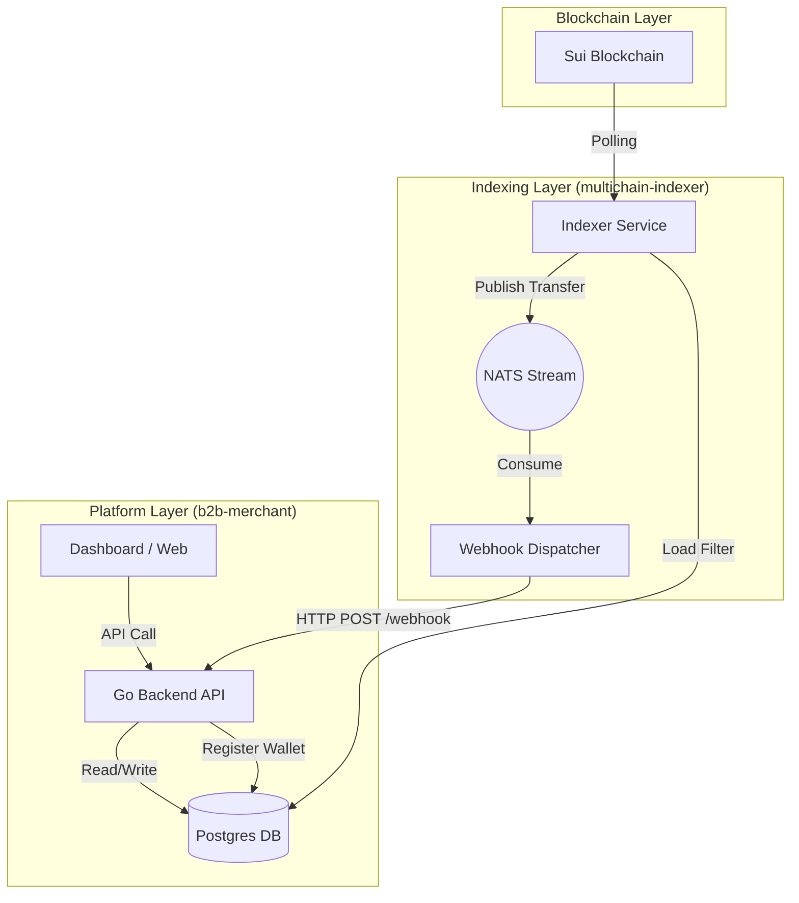
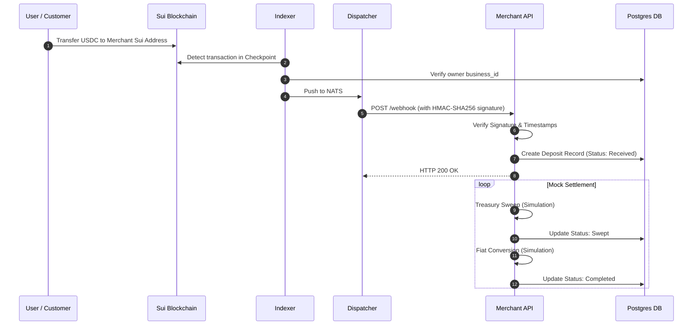
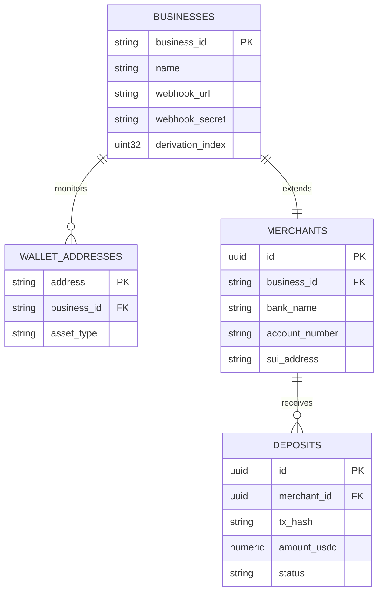

# Project Architecture — B2B Merchant Platform

The B2B Merchant Platform is a high-performance payment gateway designed to bridge the Sui blockchain with traditional fiat banking. It leverages a multi-service architecture to detect, reconcile, and process USDC deposits for registered merchants.

## System Overview

The system consists of three primary services working in concert:

1.  **B2B Merchant API (`b2b-merchant`)**: The core application managing merchant profiles, banking details, and deposit status tracking.
2.  **Multichain Indexer (`indexer`)**: A specialized service that monitors the Sui blockchain for specific transaction patterns (USDC transfers to merchant-owned addresses).
3.  **Webhook Dispatcher (`dispatcher`)**: A delivery engine that consumes events from NATS and reliably triggers callback webhooks to the Merchant API.

### Service Interactions

## Core Data Flow

### 1. Merchant Onboarding
When a merchant registers:
1.  The `merchant` service derives a unique Sui address using **BIP-44** (deterministic wallet derivation).
2.  The address is registered in the shared `wallet_addresses` table.
3.  The Indexer service (running in parallel) detects the new address via a **Bloom Filter** or direct DB lookup and begins monitoring it.

### 2. Deposit Lifecycle (Sequence)

## Database Schema (ERD)

The system utilizes a shared Postgres database between the indexer and the merchant platform.

## Package Breakdown

### `internal/merchant`
Handles the business logic for merchant lifecycle. It integrates with the `multichain-indexer/pkg/wallet` package to perform hardware-compatible address derivation. It ensures that every merchant created in our platform has a corresponding "Business" entry for the indexer to track.

### `internal/webhook`
The critical entry point for incoming blockchain events. It handles:
- **Security**: Validates incoming `X-Webhook-Signature` using the merchant's secret key.
- **Idempotency**: Prevents duplicate processing of the same transaction hash.
- **Reconciliation**: Converts raw on-chain amounts (6 decimals for USDC) into human-readable numeric values.

### `internal/deposit`
Manages the state transitions of a deposit. In the current implementation, it includes a `mockProcess` routine that simulates the time-delayed steps of moving funds from a merchant-specific wallet to a central treasury and finally to a fiat bank account.

## Tech Stack

- **Backend**: Go 1.25+ (Standard library `net/http` for API, `gorm` for mapping shared models).
- **Messaging**: NATS JetStream (Async event delivery between indexer and dispatcher).
- **Database**: Postgres 16+ (Shared schema architecture).
- **Blockchain Interface**: Sui Go SDK (via the `indexer` module).
- **Branding/UI**: Vanilla HTML/JavaScript with a modern, responsive CSS dashboard.
